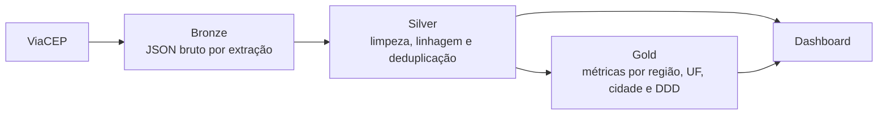

# Pipeline Medallion de CEPs

Pipeline de dados em Python que consulta a API pública
[ViaCEP](https://viacep.com.br/), preserva os dados brutos, realiza limpeza e
deduplicação, calcula métricas analíticas e disponibiliza um dashboard local.

## Arquitetura



| Componente | Responsabilidade |
|---|---|
| `extracao_bronze.py` | Valida e consulta CEPs, com timeout e tratamento de falhas |
| `processamento_silver.py` | Limpa, padroniza, adiciona linhagem e mantém o CEP mais recente |
| `processamento_gold.py` | Gera distribuições agregadas para análise |
| `pipeline.py` | Executa Bronze → Silver → Gold em um único comando |
| `dashboard_server.py` | Serve localmente somente o dashboard e os dados necessários |
| `index.html` | Exibe métricas, gráficos, busca, tabela e detalhes dos CEPs |

Os dados são organizados em `datalake/bronze`, `datalake/silver` e
`datalake/gold`. O repositório contém uma pequena amostra demonstrativa para que
o dashboard possa ser aberto logo após a instalação.

## Principais características

- arquitetura Medallion com separação clara entre dados brutos e derivados;
- validação de CEP e tratamento de timeout, HTTP e JSON inválido;
- nomes de arquivo sem colisão, com timestamp até microssegundos;
- processamento Silver idempotente e deduplicação pelo evento mais recente;
- metadados de origem, extração e processamento;
- suporte à evolução de campos retornados pela API;
- servidor restrito a `127.0.0.1`, sem exposição dos demais arquivos do projeto;
- testes unitários e integrados executados também no GitHub Actions.

## Pré-requisitos

- Python 3.10 ou superior

## Instalação

```bash
python -m venv .venv

# Linux/macOS
source .venv/bin/activate

# Windows PowerShell
.venv\Scripts\Activate.ps1

python -m pip install -r requirements.txt
```

## Execução rápida

Consulte um CEP e processe todas as camadas:

```bash
python pipeline.py --cep 01001000
```

Consulte vários CEPs na mesma execução:

```bash
python pipeline.py --cep 01001000 --cep 20040002 --cep 30140071
```

Reprocesse apenas os arquivos que já existem na Bronze, sem acessar a API:

```bash
python pipeline.py --somente-processar
```

Inicie o dashboard:

```bash
python dashboard_server.py
```

A aplicação abre `http://127.0.0.1:8000`. Para impedir a abertura automática
do navegador ou escolher outra porta, use:

```bash
python dashboard_server.py --sem-navegador --porta 8080
```

Os scripts das camadas também podem ser executados separadamente:

```bash
python extracao_bronze.py 01001000
python processamento_silver.py
python processamento_gold.py
```

## Testes

```bash
python -m unittest discover -s tests -v
```

Os testes não acessam a internet nem alteram o datalake do projeto. Eles usam
diretórios temporários e simulam a resposta do ViaCEP.

## Estrutura das saídas

```text
datalake/
├── bronze/  # uma resposta JSON bruta por consulta
├── silver/  # JSON por CEP + consolidado_ceps.csv
└── gold/    # relatório completo + distribuições por dimensão
```

Este projeto tem finalidade educacional e de portfólio. O servidor foi pensado
para execução local, não para exposição direta em produção.
