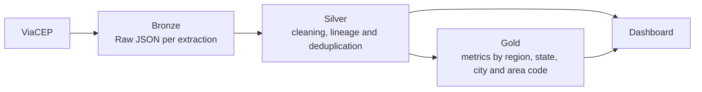

# CEP Medallion Pipeline

[🇧🇷 Versão em Português](LEIA-ME.md)

Python data pipeline that queries the public [ViaCEP](https://viacep.com.br/) API, preserves raw data, performs cleaning and deduplication, calculates analytical metrics, and provides a local dashboard.


## Architecture



| Component                 | Responsibility                                                               |
| ------------------------- | ---------------------------------------------------------------------------- |
| `extracao_bronze.py`      | Validates and queries ZIP codes, with timeout and failure handling           |
| `processamento_silver.py` | Cleans, standardizes, adds lineage and keeps the most recent ZIP code record |
| `processamento_gold.py`   | Generates aggregated distributions for analysis                              |
| `pipeline.py`             | Executes Bronze → Silver → Gold in a single command                          |
| `dashboard_server.py`     | Locally serves only the dashboard and the required data                      |
| `index.html`              | Displays metrics, charts, search, table and ZIP code details                 |

Data is organized into `datalake/bronze`, `datalake/silver` and `datalake/gold`. The repository contains a small demonstration sample so that the dashboard can be opened immediately after installation.

## Key Features

* Medallion Architecture with clear separation between raw and derived data;
* ZIP code validation and handling of timeout, HTTP and invalid JSON errors;
* collision-free file names using timestamps with microsecond precision;
* idempotent Silver processing and deduplication based on the most recent event;
* source, extraction and processing metadata;
* support for field evolution in the API response;
* server restricted to `127.0.0.1`, without exposing other project files;
* unit and integration tests also executed through GitHub Actions.

## Requirements

* Python 3.10 or higher

## Installation

```bash
python -m venv .venv

# Linux/macOS
source .venv/bin/activate

# Windows PowerShell
.venv\Scripts\Activate.ps1

python -m pip install -r requirements.txt
```

## Quick Start

Query a ZIP code and process all layers:

```bash
python pipeline.py --cep 01001000
```

Query multiple ZIP codes in the same execution:

```bash
python pipeline.py --cep 01001000 --cep 20040002 --cep 30140071
```

Reprocess only the files that already exist in Bronze, without accessing the API:

```bash
python pipeline.py --somente-processar
```

Start the dashboard:

```bash
python dashboard_server.py
```

The application opens at `http://127.0.0.1:8000`. To prevent the browser from opening automatically or to choose another port, use:

```bash
python dashboard_server.py --sem-navegador --porta 8080
```

The layer scripts can also be executed separately:

```bash
python extracao_bronze.py 01001000
python processamento_silver.py
python processamento_gold.py
```

## Tests

```bash
python -m unittest discover -s tests -v
```

The tests do not access the internet or modify the project's datalake. They use temporary directories and simulate the ViaCEP response.

## Output Structure

```text
datalake/
├── bronze/  # one raw JSON response per query
├── silver/  # JSON per ZIP code + consolidado_ceps.csv
└── gold/    # complete report + distributions by dimension
```

This project is intended for educational and portfolio purposes. The server was designed for local execution, not for direct production exposure.
